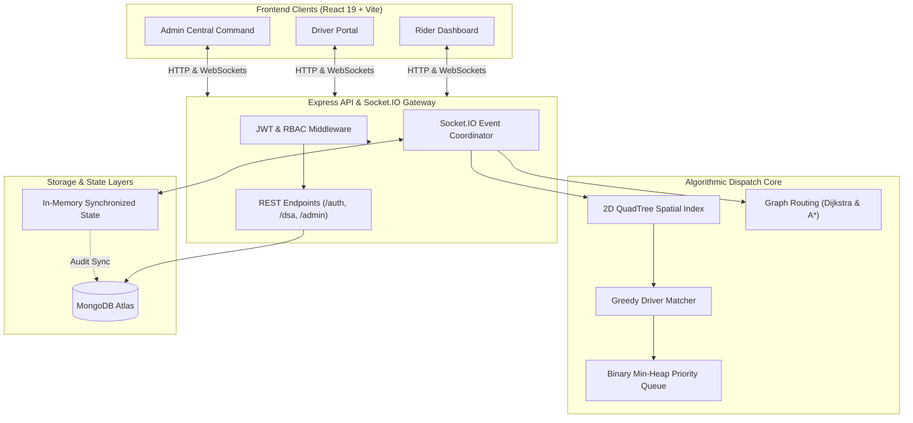

# AuraRide — Production-Grade Real-Time Mobility & Algorithmic Dispatch Platform

[](#16-automated-testing-suite)
[](https://nodejs.org/)
[](https://react.dev/)
[](https://expressjs.com/)
[](https://socket.io/)
[](https://www.mongodb.com/)
[](LICENSE)

AuraRide is a full-stack, enterprise-grade ride-hailing and intelligent mobility orchestration system built from the ground up to demonstrate advanced Data Structures and Algorithms (DSA), real-world distributed state synchronization, role-based security, and commercial-grade user experiences.

---

## Table of Contents
1. [Problem Statement](#1-problem-statement)
2. [Objectives](#2-objectives)
3. [Features](#3-features)
4. [User Roles](#4-user-roles)
5. [Technology Stack](#5-technology-stack)
6. [Architecture](#6-architecture)
7. [Database Schema](#7-database-schema)
8. [Authentication & RBAC](#8-authentication--rbac)
9. [Socket.IO Real-Time Engine](#9-socketio-real-time-engine)
10. [Dijkstra's Algorithm](#10-dijkstras-algorithm)
11. [A* Search Algorithm](#11-a-search-algorithm)
12. [Custom Binary Min-Heap Priority Queue](#12-custom-binary-min-heap-priority-queue)
13. [2D QuadTree Spatial Indexing](#13-2d-quadtree-spatial-indexing)
14. [Driver Matching Heuristic](#14-driver-matching-heuristic)
15. [Dynamic Surge Pricing](#15-dynamic-surge-pricing)
16. [Automated Testing Suite](#16-automated-testing-suite)
17. [Installation Guide](#17-installation-guide)
18. [Running the Project](#18-running-the-project)
19. [Future Scope](#19-future-scope)

---

## 1. Problem Statement
Modern urban transportation networks face significant computational and architectural hurdles:
- **Inefficient Driver Dispatching**: Naive $O(N)$ linear scans across thousands of active vehicles cause dispatch bottlenecks and sub-optimal driver assignments.
- **Sub-optimal Pathfinding & Route Latency**: Routing systems either incur heavy commercial API costs or lack algorithmic transparency when navigating high-density road graphs.
- **Volatile Supply-Demand Imbalances**: Sudden localized ride demand spikes lead to high unfulfilled request rates without dynamic pricing feedback loops.
- **State Synchronization Delays**: Disconnects between client UI states, backend spatial indexes, and persistent databases lead to stale ride requests and phantom bookings.

AuraRide solves these challenges with an integrated algorithmic core combining **2D QuadTree spatial indexing**, **greedy Min-Heap heuristic dispatch**, **A\* / Dijkstra graph routing**, and **real-time bi-directional WebSocket telemetry**.

---

## 2. Objectives
- **Algorithmic Rigor**: Implement and benchmark custom Data Structures and Algorithms in pure JavaScript (QuadTree, Binary Min-Heap, Dijkstra, A\*) without black-box third-party routing libraries.
- **Sub-Millisecond Spatial Indexing**: Reduce candidate driver search complexity from $O(N)$ to $O(\log N)$ (average) via 2D spatial partitioning.
- **Deterministic Multi-Factor Dispatch**: Match riders with optimal drivers balancing Euclidean proximity (60%) and driver quality rating (40%) with strict vehicle compatibility.
- **Zero-Latency Real-Time Telemetry**: Coordinate instantaneous state transitions (`REQUESTED` $\rightarrow$ `ACCEPTED` $\rightarrow$ `IN_TRANSIT` $\rightarrow$ `COMPLETED`) across riders, drivers, and platform operators.
- **Hardened Security & RBAC**: Enforce zero-trust token authentication, strict role-based access control, parameterized queries, and segregated administrative provisioning.

---

## 3. Features
- **Uber-Class Consumer UI**: Ultra-clean, dark-themed responsive interface featuring live Leaflet maps with custom vehicle tracking markers, route polylines, and real-time pickup/dropoff pins.
- **Global Address Autocomplete**: Integrated OpenStreetMap Nominatim geocoding engine with debounced typing (350ms) and automatic fallback to localized landmark hubs.
- **Multi-Tier Vehicle Selection**: Instant pricing calculations across *Economy*, *Comfort*, and *Premium* tiers with vehicle-class validation.
- **Live Ride Lifecycle Orchestration**: Interactive rider acceptance, dynamic turn-by-turn route simulation, driver arrival broadcast, and trip completion receipts.
- **Interactive Algorithmic Benchmark Suite**: Real-time side-by-side execution of Dijkstra vs. A\* using `performance.now()` precision timing, nodes visited comparison, path cost parity verification, and QuadTree radial query benchmarks.
- **Driver Partner Console**: Online/offline toggle, real-time dispatch alerts with accept/decline modal, and live trip status updates.
- **Central Administrative Command**: Platform gross revenue tracker, active driver fleet monitor, verification toggle, user account suspension switch, and real-time Socket.IO health metrics.

---

## 4. User Roles

| Role | Permissions & Access Privileges | Primary Interface |
| :--- | :--- | :--- |
| **Rider** | Search addresses, view routes, calculate fares with surge pricing, dispatch rides, track assigned drivers live on map, view trip history. | `/` (Rider Dashboard) |
| **Driver** | Toggle online/offline status, broadcast GPS coordinates, receive prioritized ride dispatches, accept/reject rides, simulate transit to destination. | `/driver` (Driver Portal) |
| **Admin** | View platform revenue and DSA performance metrics, verify or suspend drivers, block abusive accounts, inspect active rides. Protected by RBAC middleware. | `/admin` (Central Command) |

---

## 5. Technology Stack

### Backend Engine
- **Runtime**: Node.js (v20+ LTS)
- **Framework**: Express.js 5.x
- **Real-Time Communication**: Socket.IO 4.8.x (WebSockets with polling fallback)
- **Database & ODM**: MongoDB Atlas / Mongoose 8.x
- **Security & Cryptography**: JSON Web Tokens (`jsonwebtoken`), `bcryptjs`, CORS middleware
- **Testing Runner**: Node.js Native Test Runner (`node:test`, `node:assert/strict`)

### Frontend Application
- **Framework**: React 19 (Hooks, Context API)
- **Build Tool**: Vite 8.x
- **Styling**: Tailwind CSS
- **Mapping & Geospatial**: Leaflet 1.9, React-Leaflet
- **Icons & UI Primitives**: Lucide React
- **HTTP Client**: Axios

---

## 6. Architecture



---

## 7. Database Schema

### User Schema (`User.js`)
- `_id`: ObjectId (Primary Key)
- `name`: String (Required, trimmed)
- `email`: String (Required, unique, lowercase, indexed)
- `password`: String (Required, hashed with bcrypt 10 rounds)
- `role`: String (Enum: `['rider', 'driver', 'admin']`, default: `'rider'`)
- `phone`: String (Optional)
- `isBlocked`: Boolean (Default: `false`)
- `createdAt`, `updatedAt`: Timestamps

### Driver Schema (`Driver.js`)
- `_id`: ObjectId (Primary Key)
- `user`: ObjectId (Ref: `'User'`, required, unique)
- `vehicle`: Object (`{ make, model, year, plateNumber, color, type: ['Economy', 'Comfort', 'Premium'] }`)
- `licenseNumber`: String (Required)
- `isVerified`: Boolean (Default: `true`)
- `isOnline`: Boolean (Default: `false`, indexed)
- `currentLocation`: Object (`{ lat: Number, lng: Number }`)
- `rating`: Number (Default: `5.0`, indexed)
- `totalRatings`: Number (Default: `0`)
- `totalEarnings`: Number (Default: `0`)
- `createdAt`, `updatedAt`: Timestamps

### Ride Schema (`Ride.js`)
- `_id`: ObjectId (Primary Key)
- `rider`: ObjectId (Ref: `'User'`, required, indexed)
- `driver`: ObjectId (Ref: `'Driver'`, default: `null`, indexed)
- `pickup`: Object (`{ address, location: { lat, lng } }`)
- `destination`: Object (`{ address, location: { lat, lng } }`)
- `fare`: Number (Required)
- `distance`: Number (in km)
- `duration`: Number (in minutes)
- `vehicleType`: String (Enum: `['Economy', 'Comfort', 'Premium']`)
- `status`: String (Enum: `['REQUESTED', 'ACCEPTED', 'ARRIVED', 'IN_TRANSIT', 'COMPLETED', 'CANCELLED']`, default: `'REQUESTED'`, indexed)
- `surgeMultiplier`: Number (Default: `1.0`)
- `path`: Array of coordinate pairs `[[lat, lng], ...]`
- `createdAt`, `updatedAt`: Timestamps

---

## 8. Authentication & RBAC

### Security Policies
1. **Public Self-Registration Restrictions**:
   - The `/api/auth/register` endpoint permits only `rider` and `driver` roles.
   - Any registration payload attempting `role: "admin"` is strictly rejected with **HTTP 400 Bad Request**.
2. **Dedicated Admin Seeding**:
   - Administrative accounts are provisioned exclusively through authorized server initialization or the secure CLI utility:
     ```bash
     npm run create:admin
     ```
3. **Route Protection & Authorization**:
   - All `/api/admin/*` endpoints enforce two-tier middleware verification:
     - `authMiddleware.protect`: Verifies JWT authenticity, expiration, and extracts user identity. Unauthenticated requests receive **HTTP 401 Unauthorized**.
     - `authMiddleware.authorizeRoles('admin')`: Enforces role-based authorization. Valid tokens belonging to `rider` or `driver` accounts are blocked with **HTTP 403 Forbidden**.
4. **Password Security**:
   - Passwords are salt-hashed using `bcryptjs` with work factor 10. Passwords are excluded from user query projections (`select: '-password'`).

---

## 9. Socket.IO Real-Time Engine

The real-time layer synchronizes state across connected clients via private and broadcast rooms:

| Socket Event | Direction | Payload | Architectural Purpose |
| :--- | :--- | :--- | :--- |
| `driver:register` | Client $\rightarrow$ Server | `{ driverId, coords }` | Joins `'drivers'` room, inserts into QuadTree, updates DB. |
| `driver:locationUpdate`| Client $\rightarrow$ Server | `{ driverId, coords, isOnline }` | Updates spatial index, broadcasts to `'admin'` & active rider. |
| `ride:request` | Client $\rightarrow$ Server | `{ riderId, pickup, destination, fare, vehicleType, path }` | Runs QuadTree radius search + Min-Heap match; alerts optimal driver. |
| `ride:dispatched` | Server $\rightarrow$ Client | `{ rideId, ride, optimalDriver }` | Targeted alert to assigned driver with route & pickup telemetry. |
| `ride:accept` | Client $\rightarrow$ Server | `{ rideId, driverId }` | Transitions ride to `ACCEPTED`, assigns driver, notifies rider. |
| `ride:start` | Client $\rightarrow$ Server | `{ rideId }` | Transitions ride to `IN_TRANSIT`, begins waypoint broadcast. |
| `driver:progress` | Server $\rightarrow$ Client | `{ rideId, coords, progress, remainingKm }` | Emits vehicle coordinates along calculated shortest path. |
| `ride:complete` | Client $\rightarrow$ Server | `{ rideId }` | Finalizes ride to `COMPLETED`, adds revenue, frees driver. |
| `admin:metricsUpdate` | Server $\rightarrow$ Admin Room | Platform metrics object | Pushes live counts of online drivers, rides, and revenue. |

---

## 10. Dijkstra's Algorithm

### Theoretical Foundation
Dijkstra's Algorithm solves the Single-Source Shortest Path (SSSP) problem on weighted graphs with non-negative edge weights.

- **Data Structure**: Min-Heap Priority Queue storing `(nodeId, cumulativeDistance)`.
- **Time Complexity**: $\mathcal{O}((V + E) \log V)$ where $V$ is vertices and $E$ is edges.
- **Space Complexity**: $\mathcal{O}(V)$ for distance table, visited set, and priority queue storage.
- **Implementation Guarantee**: AuraRide's implementation guarantees the mathematically optimal shortest path between any two road graph intersections.

```javascript
// Sample invocation
const { findShortestPath } = require('./src/dsa/Dijkstra');
const result = findShortestPath('A1', 'A10');
// Returns: { path: ['A1', 'A2', 'A6', 'A10'], distanceKm: 4.8, nodesVisited: 14 }
```

---

## 11. A* Search Algorithm

### Theoretical Foundation
A\* accelerates pathfinding by using a heuristic function $h(n)$ to guide graph traversal toward the target destination.

- **Evaluation Function**: $f(n) = g(n) + h(n)$
  - $g(n)$: Exact path cost accumulated from the start node to node $n$.
  - $h(n)$: Euclidean distance heuristic scaled to road network kilometers:
    $$h(n) = \sqrt{(\text{lat}_n - \text{lat}_{\text{target}})^2 + (\text{lng}_n - \text{lng}_{\text{target}})^2} \times 111.32$$
- **Time Complexity**:
  - Best Case / Well-Guided: $\mathcal{O}(E)$
  - Worst Case (Uninformative Heuristic): $\mathcal{O}((V + E) \log V)$
- **Admissibility**: Because the Euclidean straight-line distance never overestimates actual road travel distance ($h(n) \le h^*(n)$), the heuristic is strictly **admissible**, guaranteeing that A\* discovers the globally optimal path identically to Dijkstra while exploring substantially fewer nodes.

---

## 12. Custom Binary Min-Heap Priority Queue

AuraRide implements a zero-dependency, array-backed Binary Min-Heap (`PriorityQueue.js`) with complete parent-child index arithmetic:

- **Heap Invariant**: $A[\text{parent}(i)] \le A[i]$ where $\text{parent}(i) = \lfloor (i - 1) / 2 \rfloor$.
- **Children Indices**: $\text{left}(i) = 2i + 1$, $\text{right}(i) = 2i + 2$.
- **Operations**:
  - `insert(element, priority)`: Appends element and executes `bubbleUp()` in $\mathcal{O}(\log N)$.
  - `extractMin()`: Removes root, moves last element to root, and executes `sinkDown()` in $\mathcal{O}(\log N)$.
  - `peek()`: Inspects minimum element in $\mathcal{O}(1)$.
  - `size()` / `isEmpty()`: Checks queue bounds in $\mathcal{O}(1)$.

---

## 13. 2D QuadTree Spatial Indexing

To eliminate inefficient $\mathcal{O}(N)$ linear fleet scans during ride dispatch, AuraRide employs a custom 2D Spatial Partitioning QuadTree (`QuadTree.js`):

- **Data Representation**:
  - Each node defines a 2D bounding box `Boundary(minLat, maxLat, minLng, maxLng)`.
  - Node capacity threshold: 4 points before quadrant subdivision.
  - Quadrants: NorthWest (NW), NorthEast (NE), SouthWest (SW), SouthEast (SE).
- **Time Complexity**:
  - Insertion: $\mathcal{O}(\log N)$ on average; $\mathcal{O}(N)$ in worst-case degenerate spatial clustering.
  - Radial Range Query: $\mathcal{O}(\log N + K)$ on average, where $K$ is the number of points retrieved inside radius $R$.
- **Dispatch Integration**: During `ride:request`, the dispatch engine queries the QuadTree with the rider's pickup coordinates with an 8.5 km radius. Only the localized candidate subset is evaluated, protecting the server against scaling bottlenecks.

---

## 14. Driver Matching Heuristic

Candidate drivers retrieved from spatial indexing are prioritized using a multi-factor greedy cost function:

$$\text{Score}(d) = (0.6 \times \text{Distance}_{\text{km}}) - (0.4 \times \text{Rating})$$

- **Lower Score = Higher Priority**:
  - Proximity Weight ($0.6$): Minimizes rider wait times and driver deadheading.
  - Quality Weight ($0.4$): Rewards drivers with higher ratings.
- **Strict Vehicle Class Matching**:
  - If a rider books a `Comfort` ride, only verified drivers operating `Comfort` vehicles are eligible.
  - If no compatible drivers are currently online, the system returns `optimalDriver: null` and alerts the rider instead of silently substituting an incorrect vehicle tier.

---

## 15. Dynamic Surge Pricing

AuraRide continuously computes dynamic surge pricing multipliers to balance local market demand and driver supply:

$$\text{Multiplier} = \max\left(1.0, \, \min\left(2.5, \, 1.0 + \frac{\text{ActiveRequests} - \text{AvailableDrivers}}{\text{AvailableDrivers} \times 2}\right)\right)$$

- **Baseline**: $1.0\times$ (Standard fare rate).
- **Ceiling**: $2.5\times$ (Maximum fair pricing cap).
- **Fare Breakdown**:
  $$\text{Final Fare} = (\text{Base Fare} + (\text{Distance}_{\text{km}} \times \text{Rate}_{\text{tier}})) \times \text{Multiplier}$$
  - Economy: Base ₹50 + ₹12/km
  - Comfort: Base ₹80 + ₹16/km
  - Premium: Base ₹120 + ₹22/km

---

## 16. Automated Testing Suite

AuraRide features a zero-dependency, production-grade automated test suite executed via the native Node.js test runner (`node:test` and `node:assert/strict`).

### Run All Tests
```bash
cd backend
npm test
```

### Test Suite Results (20/20 Passing)
```
▶ AuraRide Admin Security & RBAC Suite
  ✔ GET /admin/metrics - REJECTS unauthenticated requests (HTTP 401)
  ✔ GET /admin/metrics - REJECTS riders with HTTP 403 Forbidden
  ✔ GET /admin/metrics - REJECTS drivers with HTTP 403 Forbidden
  ✔ GET /admin/metrics - ALLOWS authenticated admin with HTTP 200 OK
  ✔ GET /admin/drivers - ALLOWS authenticated admin to inspect fleet
  ✔ GET /admin/rides - ALLOWS authenticated admin to inspect rides
✔ AuraRide Admin Security & RBAC Suite (6 tests)

▶ AuraRide Authentication & Registration Security Suite
  ✔ POST /register - successfully registers a rider
  ✔ POST /register - successfully registers a driver with vehicle details
  ✔ POST /register - REJECTS public admin registration (Security Item 2)
  ✔ POST /register - rejects duplicate email registration
  ✔ POST /login - authenticates valid credentials successfully
  ✔ POST /login - rejects invalid password
  ✔ POST /login - rejects non-existent email
✔ AuraRide Authentication & Registration Security Suite (7 tests)

▶ AuraRide DSA Core Engine Suite
  ✔ Graph - initializes with 15 nodes and valid street connections
  ✔ Dijkstra - computes optimal shortest path from A1 to A10
  ✔ A* Search - finds globally optimal path equivalent in cost to Dijkstra
  ✔ 2D QuadTree - partitions spatial coordinates and queries radius correctly
  ✔ DriverMatcher - greedy Min-Heap ranks by proximity and rating
  ✔ DriverMatcher - strictly respects vehicle compatibility (no silent fallback)
  ✔ Benchmark Engine - measures actual performance.now() timings and records path metrics
✔ AuraRide DSA Core Engine Suite (7 tests)

ℹ tests 20 | suites 3 | pass 20 | fail 0
```

---

## 17. Installation Guide

### Prerequisites
- [Node.js](https://nodejs.org/) (v20.0.0 or higher recommended)
- [npm](https://www.npmjs.com/) (v9.0.0 or higher)
- [MongoDB](https://www.mongodb.com/) (Local instance or free MongoDB Atlas URI)

### Step 1: Clone Repository & Configure Environment
```bash
git clone https://github.com/jayaaaa05/auraride.git
cd auraride
```

### Step 2: Configure Backend Environment Variables
Create `backend/.env` based on `backend/.env.example`:
```ini
PORT=5000
MONGODB_URI=mongodb+srv://<username>:<password>@cluster0.mongodb.net/auraride?retryWrites=true&w=majority
JWT_SECRET=your_jwt_secret_key_minimum_32_characters_long
ADMIN_SECRET=your_admin_secret_provisioning_key
```

### Step 3: Configure Frontend Environment Variables
Create `frontend/.env` based on `frontend/.env.example`:
```ini
VITE_API_URL=http://localhost:5000/api
VITE_SOCKET_URL=http://localhost:5000
```

### Step 4: Install Dependencies
```bash
# Install backend dependencies
cd backend
npm install

# Install frontend dependencies
cd ../frontend
npm install
```

---

## 18. Running the Project

### 1. Seed or Provision the Admin Account
To create an administrative user with full Central Command privileges:
```bash
cd backend
npm run create:admin
```
*(Default seeded admin: `admin@auraride.in` / `Admin@123`)*

### 2. Start Backend API & Socket.IO Server
```bash
cd backend
npm run dev
# Server listening on http://localhost:5000
```

### 3. Start Frontend Client Application
```bash
cd frontend
npm run dev
# Application running at http://localhost:5173
```

### 4. Build Frontend for Production
```bash
cd frontend
npm run build
```

---

## 19. Future Scope
- **Multi-Modal Route Transfers**: Extend the A\* search engine to support multi-modal transit graphs (Metro, Bus, and Ride-share multimodal handoffs).
- **Redis Pub/Sub Socket Adapter**: Deploy Redis adapters to enable horizontal scaling of Socket.IO across multiple cluster nodes.
- **Dynamic Road Speed & Traffic Weights**: Ingest live traffic flow telemetry into edge weight functions $w(u, v, t)$ to dynamically alter shortest paths during rush hours.
- **Predictive Driver Repositioning**: Implement spatial machine learning models to forecast localized ride demand and proactively dispatch idle drivers to underserved QuadTree quadrants.
- **Native Mobile Applications**: Port the React client to React Native for iOS and Android with background geolocation services.

---

## License
This project is licensed under the MIT License — see the [LICENSE](LICENSE) file for details.
